# Thirteen Writeup: ROT13 LFI to Root

**Platform:** HackMyVM  
**Difficulty:** Easy  
**Date:** December 3, 2025  
**Category:** Web  
**Tags:** LFI, ROT13, FTP

## Challenge Details

### Description

Thirteen is a beginner web exploitation challenge centered around a Local File Inclusion vulnerability. The application loads files through a parameter that uses an encrypted path format. With proper enumeration, players can access sensitive system files and identify valuable information inside FTP logs, including important file paths and credentials. The challenge escalates further through the discovery of a writable Python script executed at system startup, ultimately allowing players to insert a payload and obtain full root access!

### Techniques Used
- Directory enumeration
- Reverse shell
- Fuzzing

### Tools Used
- nmap
- Gobuster
- ffuf
- netcat

---

This writeup is based on the Thirteen machine available in [HackMyVM](https://hackmyvm.eu/machines/machine.php?vm=Thirteen).

## Reconnaissance

A full Nmap scan was performed to identify open ports and services.

The scan revealed three open ports:

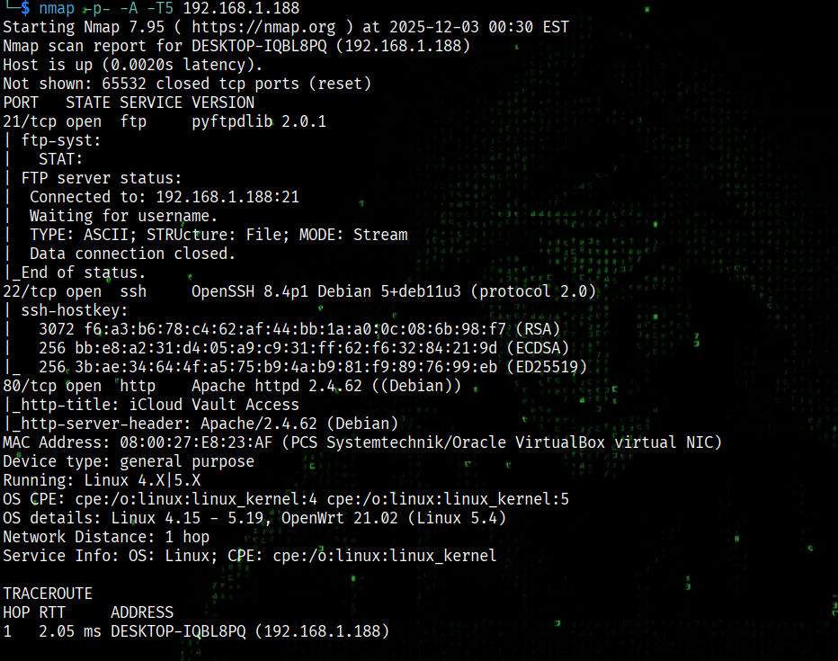

Anonymous FTP login is disabled, so the next step is to check the website.

## Web Analysis

The website displayed a form with three buttons:

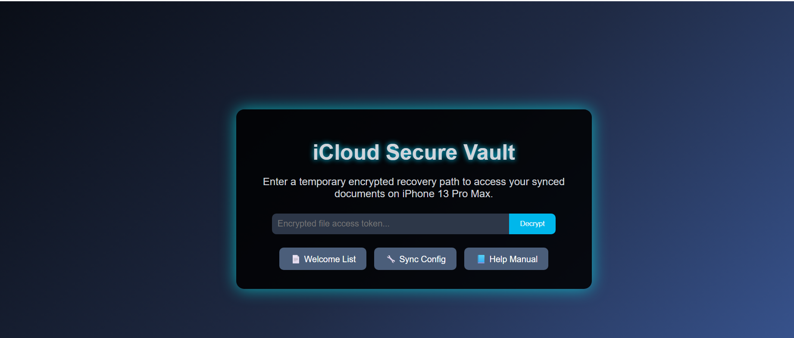

Each loading the content of a different file:

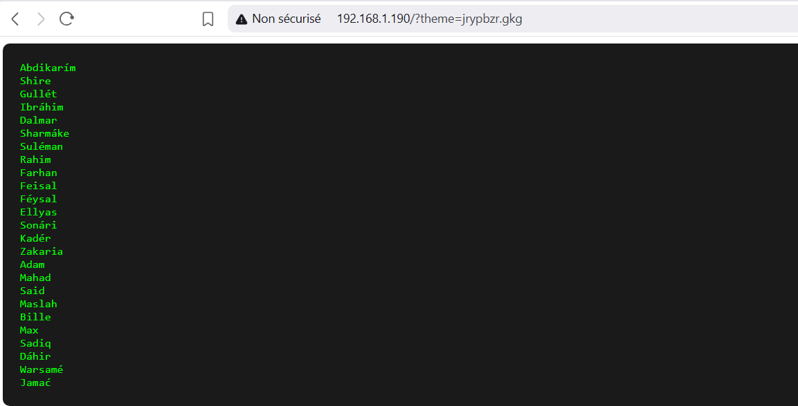

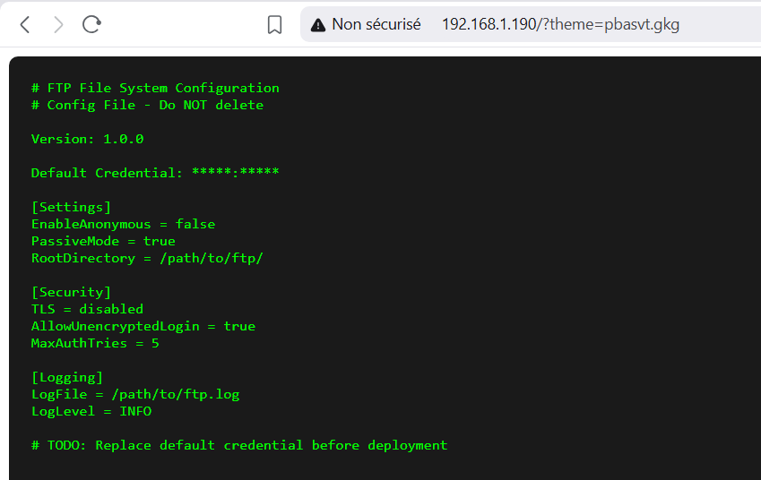

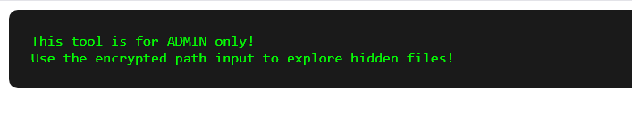

The filename was passed in the `theme=` parameter, but in an encrypted form.

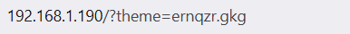

The help manual gives us a hint:

```
"Use the encrypted path input to explore hidden files!"
```

This means `theme=` accepts real filesystem paths, but they must be encrypted first.

## Identifying the Cipher and Confirming LFI

The encryption looked like a substitution cipher. Two indicators pointed directly to ROT13:

- The machine name
- The pattern of letter substitution

Decrypting one value confirmed it:

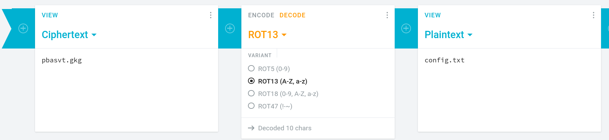

To test for Local File Inclusion, the path `/etc/passwd` was encoded with ROT13 and used inside the theme parameter.

The server returned the file contents, confirming an LFI that accepts ROT13-encoded paths.

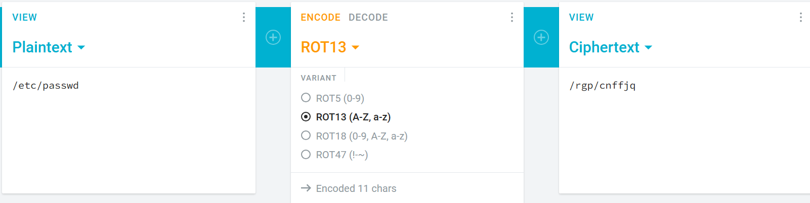

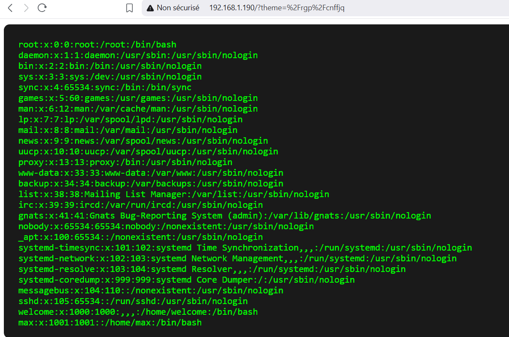

**LFI CONFIRMED!!**

## Directory Enumeration

With LFI confirmed, enumeration was performed to find interesting files.

Gobuster discovered a `/log/` directory:

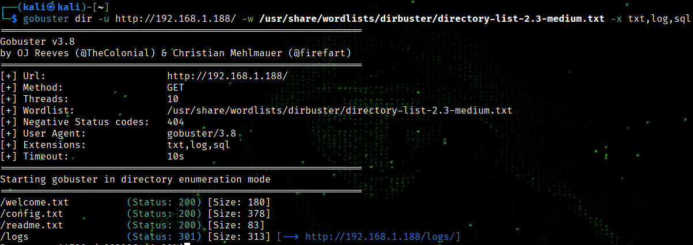

But we have no access to it:

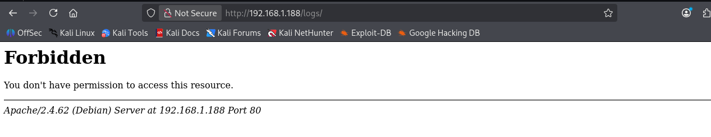

Fuzzing its contents for .log files with ffuf revealed a file named `ftp_server.log`:

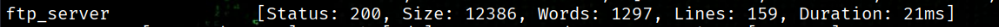

Reading this log file showed references to two files:

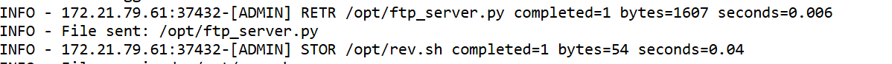

```
/opt/ftp_server.py
/opt/rev.sh
```

Both files are readable through the ROT13-based LFI.

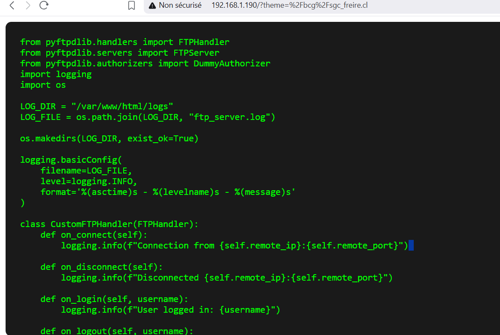

## Files Analysis

**`/opt/ftp_server.py`** is a custom FTP server script.

The script creates an FTP server that listens on port 21, allows one user (ADMIN with password 12345), and logs all FTP events into the log file (ftp_server.log).

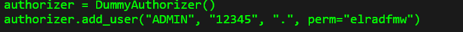

It executes automatically when the machine boots in order to start the FTP server!

**`/opt/rev.sh`** contains a reverse shell script, but it's only readable through LFI.

## Exploitation Strategy

Since `ftp_server.py` runs at system startup, modifying it allows executing any command as root.

### Steps:

**Connected to the FTP server:**

```bash
ftp <server-ip>
Username: ADMIN
Password: 12345
```

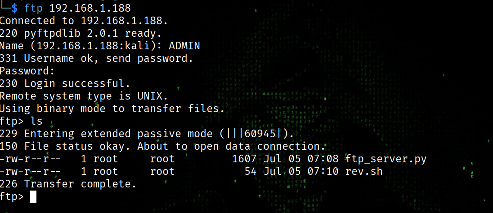

**Downloaded the Python script:**

```bash
get ftp_server.py
```


**Crafted a Python reverse shell payload:**

I used [revshells.com](https://revshells.com):

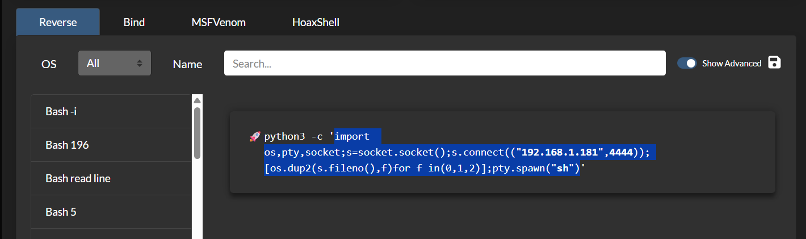

Added the payload in the main function:

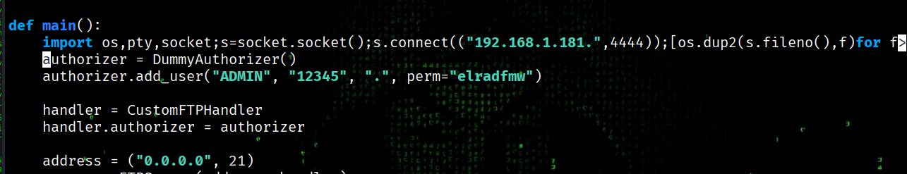

**Upload the modified script back to the FTP server:**

```bash
put ftp_server.py
```

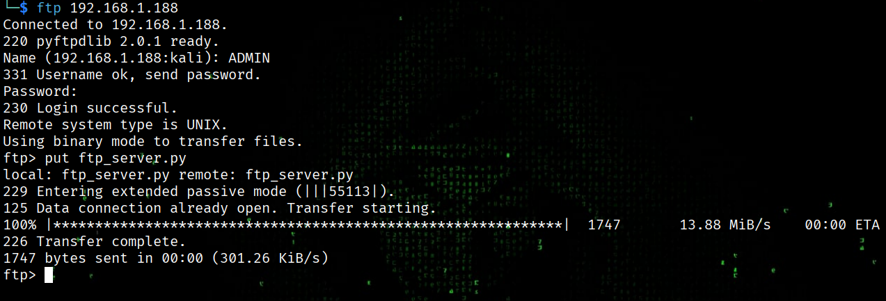

**Setting Up the Listener:**

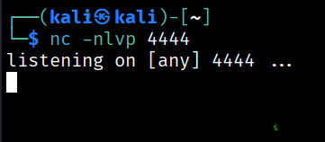

After the system restarts and the modified script runs, the listener receives a shell.

The access is obtained directly as root.

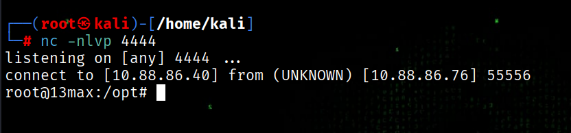

## Key Takeaways

This machine demonstrated:

1. How to identify and exploit ROT13-encoded LFI vulnerabilities
2. The importance of log file enumeration for discovering sensitive information
3. Leveraging writable startup scripts for privilege escalation

HAPPY HACKING! 🚀
